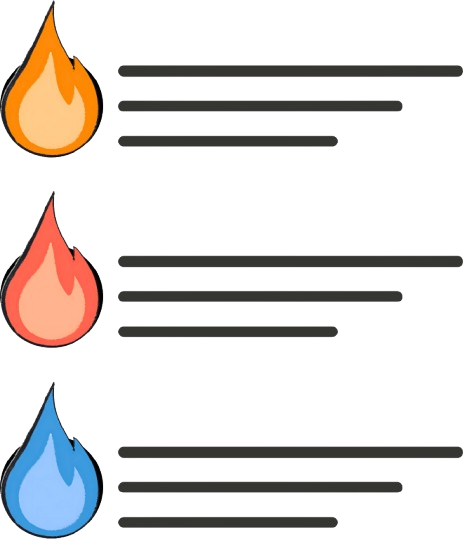

# MVVC

Short for Model-View-Visualization-Controller, a full-stack paradigm for data-driven development

This template features a task tracking website for boosting productivity

## Planned Tech Stack

# Overall structure

1. React
    1. Enter and add a task
        1. Displayed in the webpage
        2. Task is added to an array
        3. Array is pushed to local storage
    2. Mark task as done
        1. Choose which task (task number) to mark as done
            1. If invalid task number (0 or lower, length of array or higher), display error message
        2. When submitted, the array entry at index task_num - 1 is removed
            1. Array is pushed to local storage
            2. "Tasks done" counter is incremented by 1 and pushed to local storage
                1. Counter is displayed on the webpage
    3. When midnight
        1. Send daily task count to Flask
        2. Reset count on webpage to 0 and update in local storage
2. Flask
    1. 
3. SQL
4. Python

# Sources
[HTML Tutorial](https://www.w3schools.com/html/default.asp)

[CSS Tutorial](https://www.w3schools.com/css/default.asp)

[Fireship Vanilla JS ToDo App](https://youtu.be/cuHDQhDhvPE?si=UFjolhSwc55hdoCU)

[Inspiration for the website design: BigTime](https://getdemos.softwarefinder.com/pm/bigtime/?utm_campaign=Bing%20%7C%20Project%20Management%20%7C%20All%20%7C%20Branded%20%7C%20Broad&utm_term=bigtime%20time%20tracking&utm_source=bing&utm_medium=ppc&hsa_grp=1360098469050443&hsa_mt=b&hsa_tgt=kwd-85007405361521:loc-190&hsa_kw=bigtime%20time%20tracking&hsa_ad=85006564271316&hsa_acc=F149SSHR&hsa_cam=532695926&hsa_ver=3&hsa_src=o&hsa_net=bing&search_term=productivity%20apps&msclkid=8321e31f075d152202518ad4ea4525b9)

[Flask logo](https://simpleicons.org/icons/flask.svg)

[Github Shields](https://shields.io/badges)